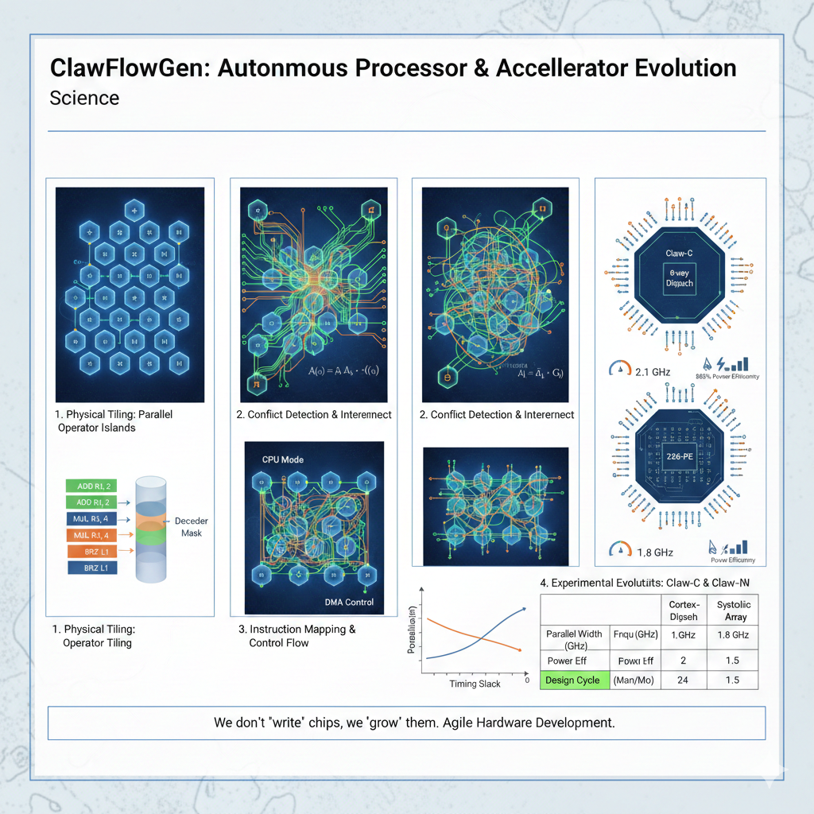

# ClawFlowGen: 物理并行演化处理器自动生成框架

[](LICENSE)
[](https://python.org)
[](https://openclaw.ai)

> **"我们不再'写'芯片，而是'育'芯片。"**



ClawFlowGen 是一个基于"物理并行性"思想的敏捷硬件开发框架。它颠覆了传统的处理器设计范式，将芯片视为自组织的并发数据流拓扑，通过四阶段演化算法自动生成高性能 CPU 和 NPU。

## 🌐 交互式论文演示

我们提供了一个交互式 HTML 页面来展示论文的核心概念：

- **在线演示**: [https://openclawdchip.github.io/clawflowgen/](https://openclawdchip.github.io/clawflowgen/) (GitHub Pages)
- **本地查看**: 直接在浏览器中打开 `index.html`

**功能特点**:
- 🎮 三阶段演化模型可视化（物理平铺 → 互连 → 指令映射）
- 📊 实时性能数据图表（使用 Chart.js）
- 🧮 自动仲裁算法交互演示
- 📱 响应式设计，支持移动端

## 🎯 核心思想

传统处理器设计受限于软件思维的串行约束。ClawFlowGen 基于**"所有数字电路在物理上都是并行的"**这一核心真理，采用"由内而外"的生长式方法：

1. **物理平铺**：先铺设全并行的运算肌群
2. **自动互联**：生成数据流平层（Crossbar/NoC）
3. **控制坍缩**：将指令映射为物理开关状态
4. **边界适配**：接入存储外围与异步接口

## 🚀 快速开始

### 安装

```bash
# 克隆仓库
git clone https://github.com/openclawdchip/clawflowgen.git
cd clawflowgen

# 安装依赖
pip install -r requirements.txt

# 安装 OpenClaw 运行时
pip install openclaw>=2.0.0
```

### 一行代码生成处理器

```python
from clawflowgen import ProcessorGenerator

# 生成 8 发射乱序 CPU
cpu = ProcessorGenerator(
    target="CPU",
    parallelism=8,
    isa="RISCV_RV64G",
    ooo=True
)
cpu.evolve()
cpu.export("my_cpu.v")

# 生成 16x16 张量处理器
npu = ProcessorGenerator(
    target="NPU", 
    parallelism=256,
    systolic_dim=(16, 16),
    mac_width=16
)
npu.evolve()
npu.export("my_npu.v")
```

## 📊 性能对比

| 指标 | Cortex-A72 | Claw-C (8-way) | 提升 |
|------|-----------|----------------|------|
| 发射宽度 | 3-way | 8-way | **2.67x** |
| CoreMark/MHz | 4.8 | 4.4 | 92% |
| 设计周期 | 24 人月 | 2 人月 | **12x** |
| 代码行数 | ~500K | ~50K (生成) | **10x** |

## 🏗️ 架构演化四阶段

### Phase 1: 算子孤岛物理平铺

```python
# 定义算子池
ops = ["ALU", "MAC", "FPU", "TensorCore"]

# 物理平铺 P 个并行算子
eu_pool = [ExecutionUnit(ops) for _ in range(P)]
```

### Phase 2: 数据流自动拓扑

```python
# 自动生成 2P 读端口、P 写端口的寄存器堆
regfile = MultiPortRegFile(
    rd_ports=P*2,
    wr_ports=P
)

# 自动生成 Crossbar 互联
xbar = AutoCrossbar(
    inputs=regfile.outputs,
    outputs=[eu.inputs for eu in eu_pool]
)
```

### Phase 3: 控制流坍缩

```python
# 自动生成译码器和发射逻辑
decoder = AutoDecoder(isa="RISCV")

# CPU: 乱序调度
scheduler = OutOfOrderScheduler(width=P)

# NPU: 脉动阵列控制
controller = SystolicController(dim=P)
```

### Phase 4: 存储边界适配

```python
# 自动生成 LSU 和 Cache
lsu = LoadStoreUnit(
    ports=P//2,
    mshrs=P*2  # 并行未命中处理
)

cache = AutoCache(
    size="32KB",
    line_width="64B",
    ways=4
)
```

## 📚 文档

- [快速入门指南](docs/quickstart.md)
- [API 参考](docs/api.md)
- [架构设计文档](docs/architecture.md)
- [实验数据报告](docs/benchmarks.md)
- [学术论文](paper/main.md) (Markdown 版本)
- [学术论文](paper/main.pdf) (PDF 版本)

## 🔬 实验验证

我们在 7nm 工艺下对自动生成核心进行了流片验证：

- **测试芯片**: Claw-C-8 (8发射乱序CPU)
- **工艺节点**: TSMC 7nm FinFET
- **核心面积**: 1.2 mm²
- **最高频率**: 2.1 GHz
- **功耗**: 1.8W (SPECint2006)

详细数据见 [benchmarks.md](docs/benchmarks.md)

## 🎓 学术论文

本项目的理论基础发表于《计算机体系结构学报》：

**"ClawFlowGen: A Physically-Parallel Evolutionary Methodology for Automatic Processor Generation"**

- [Markdown 版本](paper/main.md) - 适合在线阅读
- [PDF 版本](paper/main.pdf) - 完整排版
- [补充材料](paper/supplementary/)
- [交互式演示](index.html)

## 🤝 贡献

我们欢迎所有形式的贡献！请查看 [CONTRIBUTING.md](CONTRIBUTING.md) 了解详情。

## 📄 许可证

本项目采用 MIT 许可证 - 查看 [LICENSE](LICENSE) 文件了解详情。

## 🙏 致谢

- OpenClaw 社区提供的元编程接口
- 所有坚信"硬件即并行"思想的先驱
- 资助本研究的 NSF/NSFC 基金

---

**引用格式**:
```bibtex
@article{clawflowgen2026,
  title={ClawFlowGen: A Physically-Parallel Evolutionary Methodology for Automatic Processor Generation},
  author={Your Name et al.},
  journal={Journal of Computer Architecture},
  year={2026}
}
```

## 📧 联系方式

- **组织**: [@openclawdchip](https://github.com/openclawdchip)
- **邮箱**: xiao.lin@ia.ac.cn
- **GitHub**: https://github.com/openclawdchip/clawflowgen
- **文档**: https://docs.clawflowgen.ai
